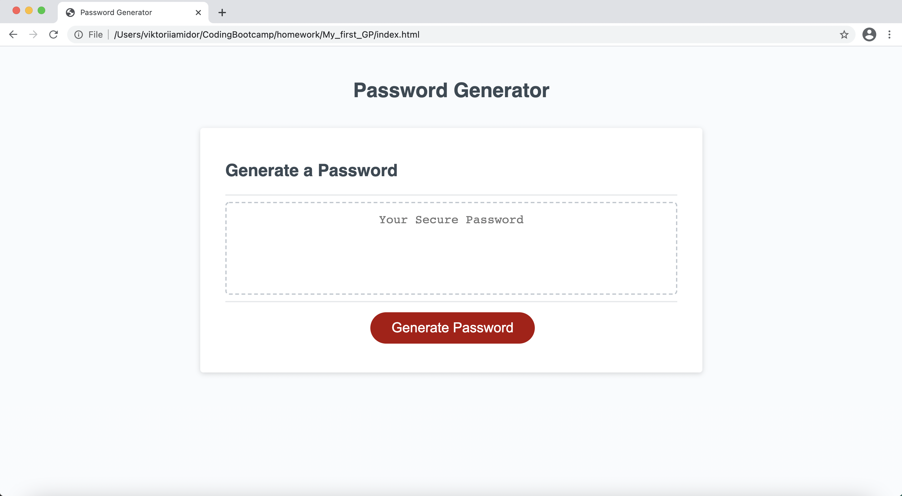

# My_first_GP

For my third [repository](https://github.com/vmidor/My_first_GP) on Github, I have created a Javascript Password Generator. This application generates a random password based on user selected criteria. The application combines the HTML, CSS, and now Javascript tools. The user will be prompted to choose from the following:
Length of password (must contain at least 8 characters but less than 128)

Character Type (user must select at least one): 
* Special characters 
* Numeric characters 
* Lowercase characters 
* Uppercase characters

The end result of the application provides the user a new and secure password. Without a set of prompts, the user would not be able to follow any directions towards generating a new password.

# Installation
Please visit the deployed project at: https://vmidor.github.io/My_first_GP/

# 

# Bonus
The user should also have the option to click a button to copy the password to their clipboard.
 
